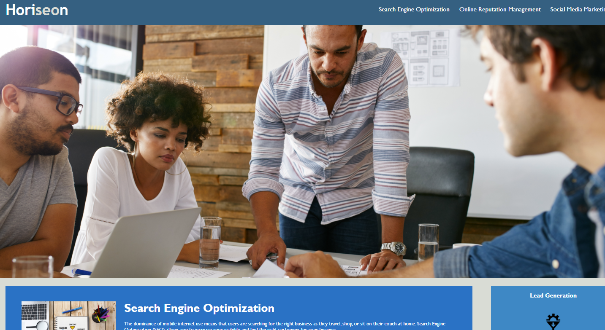

# horiseon_hw1
TABLE OF CONTENTS
1. Purpose
2. Preview
3. License 

-------
Purpose
-------

The goal of this project is to refactor the Horiseon website and make it accessibility friendly. This was done by cleaning up the codebase and using semantic tags in place of many Div tags.

-------
PREVIEW
-------

```md

```

-------
License
-------

Public domain, help yourself!